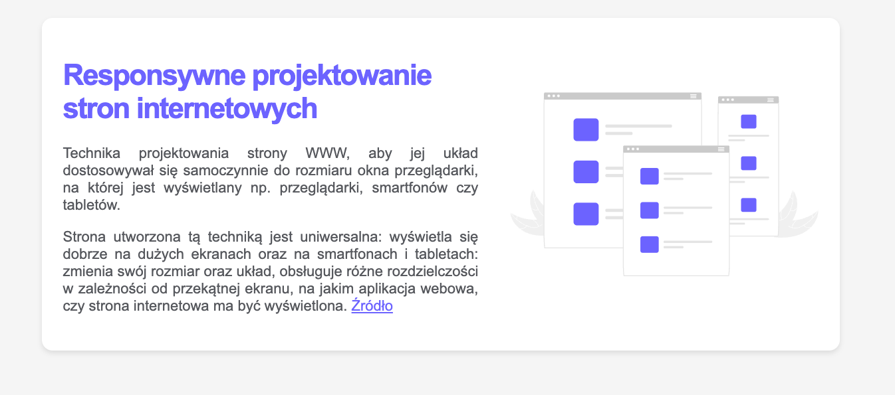

# Responsywna karta
[Kliknij tutaj aby rozwiązać zadanie](https://githubbox.com/Publishing-School/css-responsywna-karta)

[Zachowanie responsywne na tym video](https://youtu.be/otTYECK6Tb0)

Rozwiązanie

# Opis
Źródło tekstu:
https://pl.wikipedia.org/wiki/Responsive_web_design

Wykorzystacj FLEXBOX do rozmieszczenia elementów wewnątrz karty.

Grafika dostępna: `./assets/img/rwd.svg`

* Czcionka: `Arial, sans-serif`
* Kolor nagłówka: `#6c63ff`
* Kolor tła strony: `#6c63ff`
* Kolor tła karty: `#ffffff`
* Kolor akapitów: `#56585d`
* Maksymalna szerokość kontenera: `1200px`
* Minimalna szerokość grafiki: `300px`
* Zaokrąglenie narożników: `16px`
* Maksymalna szerokość kontenera z tekstem dla desktop: `55%`
* Podstawowa wielkość czcionki dla desktop: `22px`

Dla urządzeń o szerokości od 825px - 1024px
* Podstawowa wielkość czcionki: `18px`

Dla urządzeń os szerokości poniżej: `824px`
* Podstawowa wielkość czcionki: `18px`
